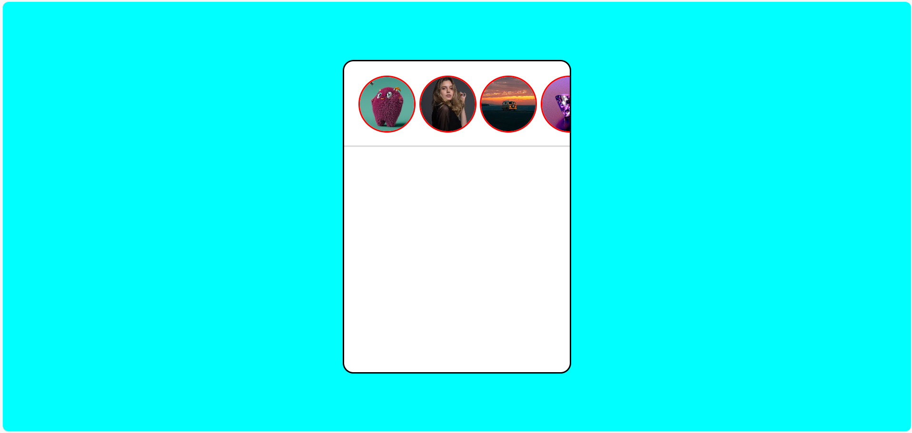
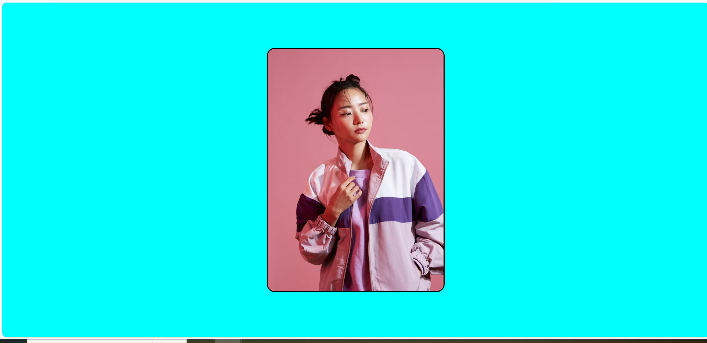

# 📸 JS Insta Story Clone (Mini Project)

A small JavaScript project that mimics the Instagram story feature. When you click on a profile image, it shows a full-screen story for 2 seconds.

---

## ✨ Features

- Dynamic creation of story thumbnails using `forEach`
- Click-to-view story overlay using `event.target.id`
- 2-second auto-hide logic with `setTimeout`
- Clean use of `querySelector` and DOM manipulation

---

## 🚀 How It Works

- An array of objects contains profile and story image URLs
- On page load, JS populates story thumbnails dynamically
- Clicking a thumbnail shows its full-screen story for 2 seconds

---

## 📸 Preview

---

## 📂 Tech Stack

- HTML
- CSS (optional styling enhancements)
- JavaScript (Vanilla)

---

### 🌐 Live Demo  
[Click here to view](https://coder-nikita.github.io/js-insta-story-clone-project/)

## 👩‍💻 Author

Made with 💜 by **Nikita Gupta**  
[GitHub → coder-Nikita](https://github.com/coder-Nikita)
